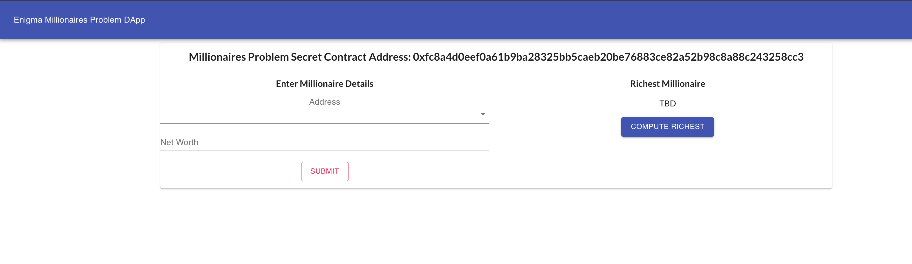
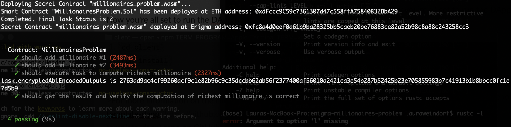

# Enigma Millionaires Problem

*Yao's Millionaire Problem*

An implementation of Yao's Millionaire Problem using the Enigma Protocol based on the [Secret Contracts: Now New and Improved!](https://blog.enigma.co/secret-contracts-now-new-and-improved-df742393d6d8) article.

The DApp allows "*millionaires*" to enter their net worth and see who is the richest without revealing their financial data to the world.

## Background
DApp implementation of the articles that introduce Enigma, the Rust programming language and the process of creating your first Enigma **secret contract** and React front-end:

 - [The Developer Quickstart Guide to Enigma](https://blog.enigma.co/the-developer-quickstart-guide-to-enigma-880c3fc4308)
 - [Getting Started with Enigma: The Rust Programming Language](https://blog.enigma.co/getting-started-with-discovery-the-rust-programming-language-4d1e0b06de15)
 - [Getting Started with Enigma: An Intro to Secret Contracts](https://blog.enigma.co/getting-started-with-enigma-an-intro-to-secret-contracts-cdba4fe501c2)
 - [Getting Started with Enigma: A Front End Demo for dApps](https://blog.enigma.co/getting-started-with-enigma-a-front-end-demo-for-dapps-bc694d3d81b9)

## Instructions
>Install the Enigma Discovery Developer Testnet:
`npm install -g @enigmampc/discovery-cli`

 1. Do a `git clone` on the repo
 2. `cd enigma-millionaires-problem`
 3. `npm install`
 4. In another terminal, start : `discovery start`
 5. Compile the contracts: `discovery compile`
 6. Migrate: `discovery migrate`
 7. Run the tests: `discovery test`

Now you're all set to run the DApp front-end:

 1. `cd client`
 2. `npm install`
 3. `npm start`

>For more information on the client front-end, see the [discovery-template-dapp](https://github.com/enigmampc/discovery-template-dapp) repo on GitHub.

## More Info

 - All things Enigma: [Enigma Technical Resource
   Index](https://blog.enigma.co/enigma-technical-resource-index-bd9110714ea6).

## Dependencies
For instructions on how to install and setup the Enigma Developer Testnet see the link above for *Getting Started with Enigma: An Intro to Secret Contracts*.
 - `rustc 1.39.0-nightly (97e58c0d3 2019-09-20)`
 - `node 10.16.3`
 - `Docker version 19.03.2, build 6a30dfc`
 - `docker-compose version 1.24.1, build 4667896b`
 - `@enigmampc/discovery-cli 0.1.3`

> Written with [StackEdit](https://stackedit.io/).
<!--stackedit_data:
eyJoaXN0b3J5IjpbLTE3OTc2NDUyNjEsNzMwOTk4MTE2XX0=
-->
